# Laboratorio 01: Diseño e Implementación de Objetos en SQL Server 2025

* **Repositorio GitHub:** [https://github.com/halca/master-labs](https://github.com/halca/master-labs)
* **Entorno:** Microsoft SQL Server 2025 (RTM - 17.0.1135.8), SQL Server Management Studio (SSMS) v20.x, Windows 11
* **Base de datos:** `EcommerceDB`

---

## 1. Creación de la Base de Datos

Inicialización del contenedor transaccional `EcommerceDB` para la plataforma de comercio electrónico.

```sql
CREATE DATABASE EcommerceDB;
GO

USE EcommerceDB;
GO
```

**Resultado de ejecución:**  
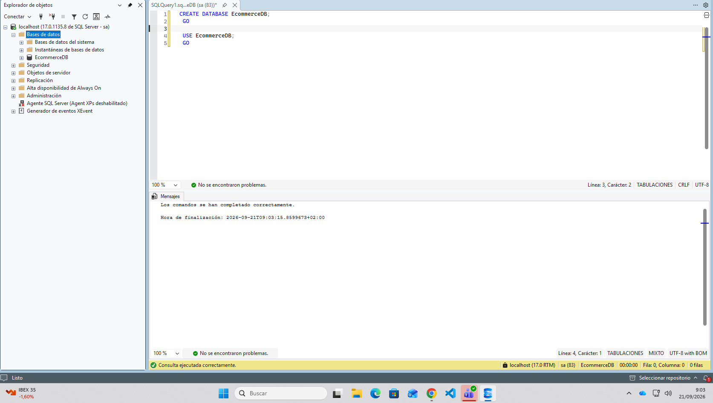

---

## 2. Creación de Tablas Principales con Restricciones e Índices

Definición de las entidades maestras `Supplier`, `Category` y `Product`. Se aplican claves primarias subrogadas (`IDENTITY`), restricciones de unicidad (`UNIQUE`), valores predeterminados (`DEFAULT`), comprobaciones lógicas (`CHECK`) y claves foráneas (`FOREIGN KEY`).

```sql
USE EcommerceDB;
GO

-- Create Supplier table
CREATE TABLE Supplier (
    SupplierID INT PRIMARY KEY IDENTITY(1,1),
    SupplierName NVARCHAR(100) NOT NULL UNIQUE,
    Country NVARCHAR(50) NOT NULL,
    Email NVARCHAR(100),
    Phone NVARCHAR(20),
    CreatedDate DATETIME2 DEFAULT GETUTCDATE()
);

-- Create Category table
CREATE TABLE Category (
    CategoryID INT PRIMARY KEY IDENTITY(1,1),
    CategoryName NVARCHAR(100) NOT NULL UNIQUE,
    Description NVARCHAR(500)
);

-- Create Product table with constraints
CREATE TABLE Product (
    ProductID INT PRIMARY KEY IDENTITY(1,1),
    ProductName NVARCHAR(100) NOT NULL,
    CategoryID INT NOT NULL,
    SupplierID INT NOT NULL,
    BasePrice DECIMAL(10,2) NOT NULL,
    StockQuantity INT NOT NULL DEFAULT 0,
    CreatedDate DATETIME2 DEFAULT GETUTCDATE(),
    CHECK (BasePrice > 0),
    CHECK (StockQuantity >= 0),
    FOREIGN KEY (CategoryID) REFERENCES Category(CategoryID),
    FOREIGN KEY (SupplierID) REFERENCES Supplier(SupplierID)
);

-- Create indexes
CREATE INDEX IX_Category ON Product(CategoryID);
CREATE INDEX IX_Supplier ON Product(SupplierID);
GO
```

**Resultado de ejecución:**  
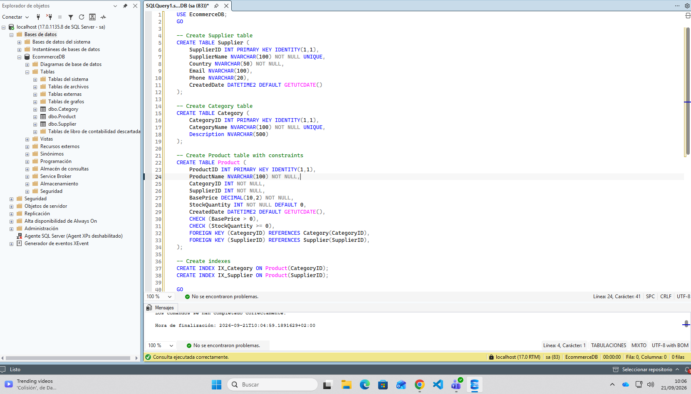

---

## 3. Inserción de Datos Iniciales en Tablas Maestras

Carga de registros de prueba para validar relaciones e integridad referencial entre proveedores, categorías y productos.

```sql
USE EcommerceDB;
GO

-- Insert sample suppliers
INSERT INTO Supplier (SupplierName, Country, Email, Phone)
VALUES 
    ('Contoso Supplies', 'USA', 'contact@contoso.com', '555-0100'),
    ('Fabrikam Inc', 'Canada', 'sales@fabrikam.com', '555-0200');

-- Insert sample categories
INSERT INTO Category (CategoryName, Description)
VALUES 
    ('Electronics', 'Electronic devices and accessories'),
    ('Clothing', 'Apparel and fashion items');

-- Insert sample products
INSERT INTO Product (ProductName, CategoryID, SupplierID, BasePrice, StockQuantity)
VALUES 
    ('Wireless Mouse', 1, 1, 29.99, 100),
    ('Cotton T-Shirt', 2, 2, 19.99, 250);
GO
```

**Resultado de ejecución:**  
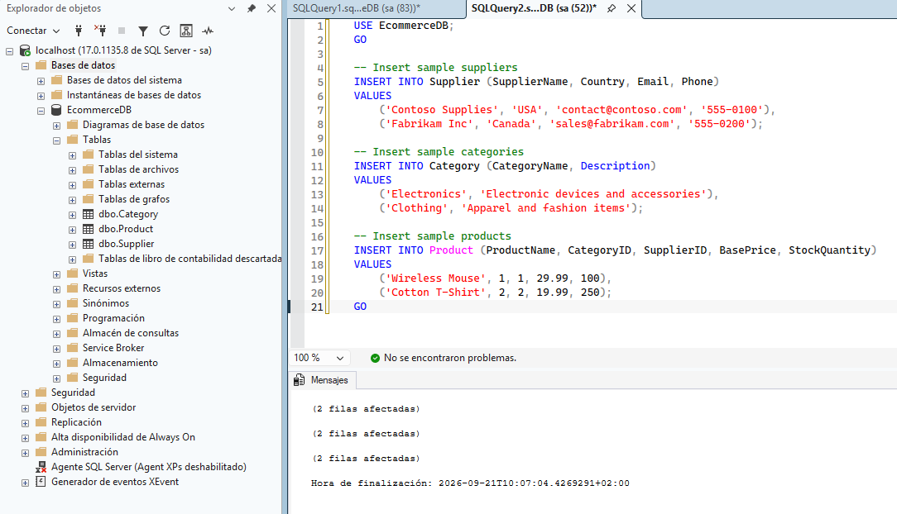

---

## 4. Implementación de Tablas Temporales (Historial de Precios)

Implementación de control de cambios temporal con control del sistema (`SYSTEM_VERSIONING = ON`) para registrar auditorías de precios de forma nativa.

```sql
USE EcommerceDB;
GO

-- Create Price History table with temporal versioning
CREATE TABLE ProductPrice (
    PriceID INT PRIMARY KEY IDENTITY(1,1),
    ProductID INT NOT NULL,
    CurrentPrice DECIMAL(10,2) NOT NULL,
    EffectiveDate DATE,
    SysStartTime DATETIME2 GENERATED ALWAYS AS ROW START HIDDEN,
    SysEndTime DATETIME2 GENERATED ALWAYS AS ROW END HIDDEN,
    PERIOD FOR SYSTEM_TIME (SysStartTime, SysEndTime),
    FOREIGN KEY (ProductID) REFERENCES Product(ProductID)
) WITH (SYSTEM_VERSIONING = ON);
GO

-- Insert initial price data
INSERT INTO ProductPrice (ProductID, CurrentPrice, EffectiveDate)
VALUES (1, 99.99, '2025-01-01'), (2, 149.99, '2025-01-01');

-- Update price (creates history entry)
UPDATE ProductPrice SET CurrentPrice = 109.99 WHERE ProductID = 1;
GO
```

**Resultado de creación y actualización temporal:**  
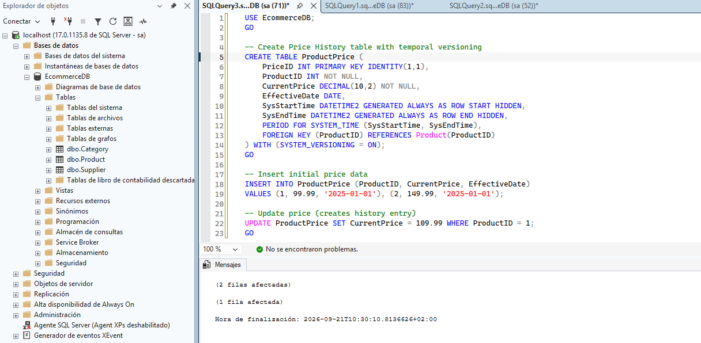

Consulta de trazabilidad histórica mediante la cláusula `FOR SYSTEM_TIME ALL`:

```sql
USE EcommerceDB;
GO

SELECT ProductID, CurrentPrice, SysStartTime, SysEndTime
FROM ProductPrice
FOR SYSTEM_TIME ALL
WHERE ProductID = 1;
```

**Resultado de la auditoría temporal:**  
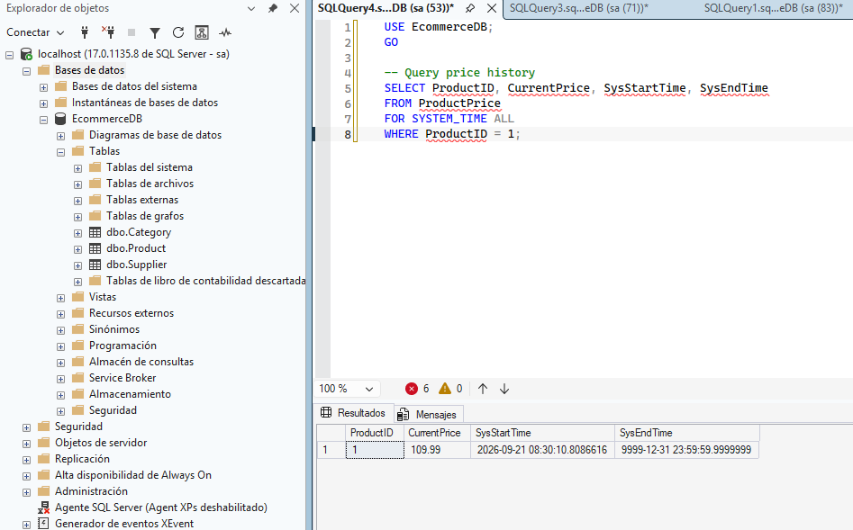

---

## 5. Almacenamiento de Metadatos con Tipo Nativo JSON

Uso del tipo nativo `JSON` incorporado en SQL Server 2025, indexación mediante columna calculada y consultas puntuales con `JSON_VALUE`.

```sql
USE EcommerceDB;
GO

-- Add metadata column to Product (JSON type requires SQL Server 2025)
ALTER TABLE Product ADD Metadata JSON;
GO

-- Add computed column for indexing
ALTER TABLE Product ADD MetadataColor AS JSON_VALUE(Metadata, '$.color');
GO

-- Create index on the computed column
CREATE NONCLUSTERED INDEX IX_Product_Metadata_Color
    ON Product (MetadataColor);
GO

-- Update products with metadata
UPDATE Product SET Metadata = N'{"color":"blue","size":"large","material":"cotton"}'
WHERE ProductID = 1;

UPDATE Product SET Metadata = N'{"color":"red","size":"small","material":"silk"}'
WHERE ProductID = 2;
GO
```

**Resultado de la configuración JSON:**  
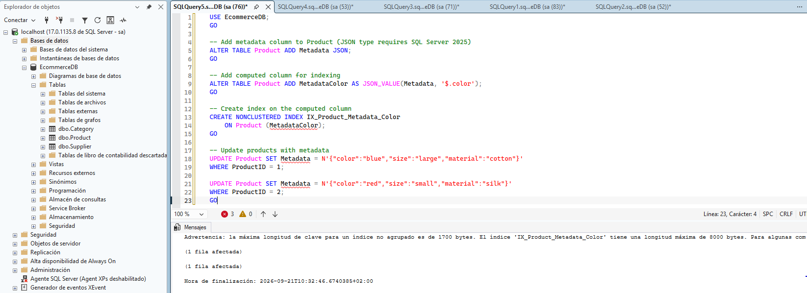

Consulta optimizada extrayendo propiedades mediante rutas JSON:

```sql
USE EcommerceDB;
GO

SELECT 
    ProductID,
    ProductName,
    JSON_VALUE(Metadata, '$.color') AS Color,
    JSON_VALUE(Metadata, '$.size') AS Size,
    JSON_VALUE(Metadata, '$.material') AS Material
FROM Product
WHERE JSON_VALUE(Metadata, '$.color') = 'blue';
```

**Resultado de la consulta JSON:**  
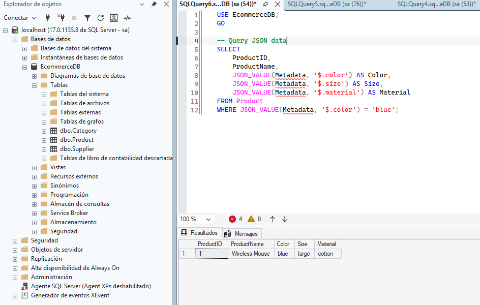

---

## 6. Particionamiento de Tablas Masivas (`Order`)

Segmentación horizontal de la tabla de pedidos mediante una función de partición por rangos de fecha (`RANGE RIGHT`) y un esquema de partición alineado sobre el grupo de archivos principal.

```sql
USE EcommerceDB;
GO

-- Create partition function for order dates
CREATE PARTITION FUNCTION PF_OrderDate (DATE)
    AS RANGE RIGHT FOR VALUES 
    ('2025-01-01', '2025-04-01', '2025-07-01', '2025-10-01');

-- Create partition scheme (single filegroup recommended)
CREATE PARTITION SCHEME PS_OrderDate
    AS PARTITION PF_OrderDate ALL TO ([PRIMARY]);

-- Create partitioned Order table
CREATE TABLE [Order] (
    OrderID BIGINT IDENTITY(1,1),
    OrderDate DATE NOT NULL,
    CustomerName NVARCHAR(100) NOT NULL,
    TotalAmount DECIMAL(12,2) NOT NULL,
    OrderStatus NVARCHAR(20) DEFAULT 'Pending',
    CONSTRAINT PK_Order PRIMARY KEY (OrderID, OrderDate),
    CHECK (TotalAmount > 0),
    CHECK (OrderStatus IN ('Pending', 'Processing', 'Shipped', 'Delivered', 'Cancelled'))
) ON PS_OrderDate(OrderDate);

-- Create partitioned index
CREATE NONCLUSTERED INDEX IX_Order_Customer
    ON [Order](CustomerName)
    ON PS_OrderDate(OrderDate);
GO

-- Insert sample orders
INSERT INTO [Order] (OrderDate, CustomerName, TotalAmount, OrderStatus) VALUES
    ('2025-01-15', 'John Smith', 299.97, 'Delivered'),
    ('2025-02-20', 'Jane Doe', 149.99, 'Shipped'),
    ('2025-06-10', 'Bob Johnson', 449.95, 'Processing');
GO
```

**Resultado de creación y carga en tabla particionada:**  
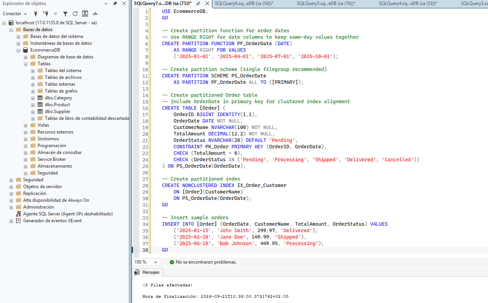

Inspección de la distribución de filas por número de partición con `$PARTITION`:

```sql
USE EcommerceDB;
GO

SELECT 
    $PARTITION.PF_OrderDate(OrderDate) AS PartitionNumber,
    COUNT(*) AS OrdersInPartition,
    MIN(OrderDate) AS MinDate,
    MAX(OrderDate) AS MaxDate
FROM [Order]
GROUP BY $PARTITION.PF_OrderDate(OrderDate);
```

**Resultado de distribución de particiones:**  
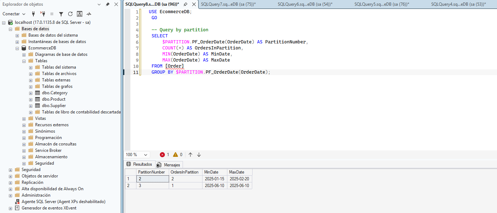

---

## 7. Generación de Claves Independientes mediante `SEQUENCE`

Creación de un generador numérico desacoplado (`OrderLineSequence`) para alimentar la clave primaria de los detalles de pedido (`OrderDetail`) mediante `NEXT VALUE FOR`.

```sql
USE EcommerceDB;
GO

-- Create SEQUENCE for order line items
CREATE SEQUENCE OrderLineSequence
    START WITH 1
    INCREMENT BY 1;

-- Create OrderDetail table
CREATE TABLE OrderDetail (
    OrderLineID INT PRIMARY KEY,
    OrderID BIGINT NOT NULL,
    OrderDate DATE NOT NULL,
    ProductID INT NOT NULL,
    Quantity INT NOT NULL,
    UnitPrice DECIMAL(10,2) NOT NULL,
    LineTotal AS (Quantity * UnitPrice),
    CHECK (Quantity > 0),
    CHECK (UnitPrice > 0),
    FOREIGN KEY (OrderID, OrderDate) REFERENCES [Order](OrderID, OrderDate),
    FOREIGN KEY (ProductID) REFERENCES Product(ProductID)
);
GO

-- Insert order details using SEQUENCE
INSERT INTO OrderDetail (OrderLineID, OrderID, OrderDate, ProductID, Quantity, UnitPrice)
VALUES 
    (NEXT VALUE FOR OrderLineSequence, 1, '2025-01-15', 1, 2, 99.99),
    (NEXT VALUE FOR OrderLineSequence, 1, '2025-01-15', 2, 1, 149.99),
    (NEXT VALUE FOR OrderLineSequence, 2, '2025-02-20', 1, 3, 99.99);
GO
```

**Resultado de la inserción secuencial:**  
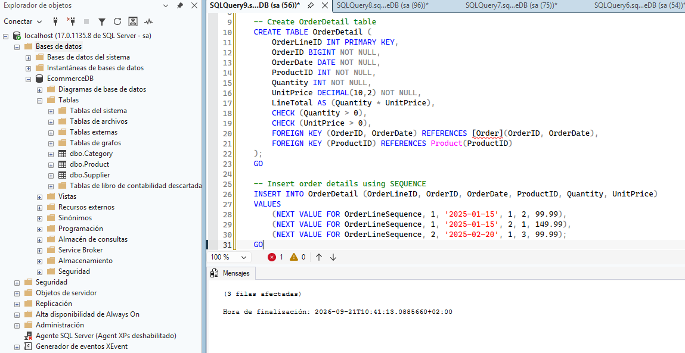

Validación de registros e identificación de correlativos generados:

```sql
USE EcommerceDB;
GO

SELECT * FROM OrderDetail;
```

**Resultado del contenido de OrderDetail:**  
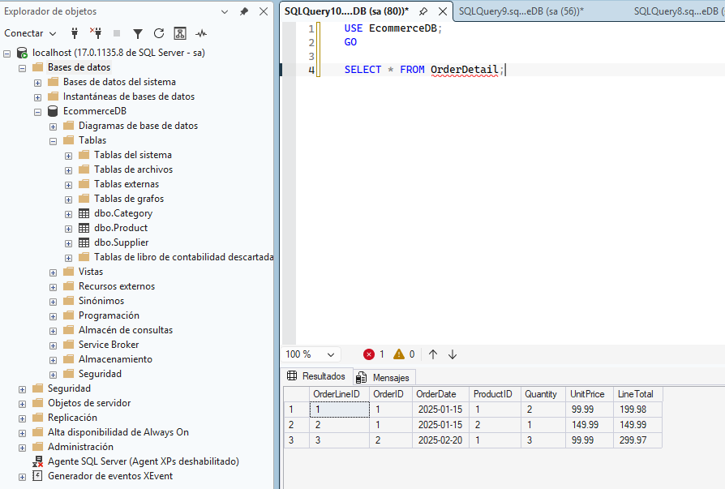

---

## 8. Verificación de Integridad y Validación de Objetos

### Validación de la restricción `CHECK`
Comprobación de que el motor cancela intentos de inserción con precios base negativos (`-50`), arrojando el error `Mens. 547` de infracción de restricción de comprobación.

```sql
USE EcommerceDB;
GO

-- This should fail: negative price
INSERT INTO Product (ProductName, CategoryID, SupplierID, BasePrice, StockQuantity)
VALUES ('Invalid', 1, 1, -50, 10);
```

**Resultado del error controlado:**  
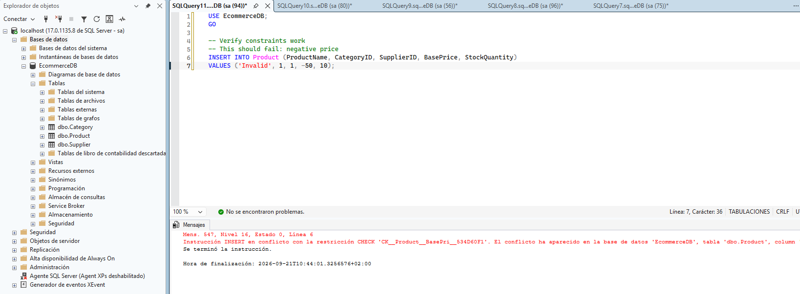

### Comprobación integral de objetos avanzados
Ejecución del lote de validación final para JSON, particiones activas y tablas temporales.

```sql
USE EcommerceDB;
GO

-- Verify JSON queries work
SELECT ProductName, JSON_VALUE(Metadata, '$.color') AS Color
FROM Product
WHERE Metadata IS NOT NULL;

-- Verify partitioning
SELECT $PARTITION.PF_OrderDate(OrderDate) AS Partition, COUNT(*) AS RecordCount
FROM [Order]
GROUP BY $PARTITION.PF_OrderDate(OrderDate);

-- Verify temporal table
SELECT ProductID, CurrentPrice, SysStartTime, SysEndTime
FROM ProductPrice FOR SYSTEM_TIME ALL
ORDER BY ProductID, SysStartTime;
```

**Resultado de la verificación global:**  
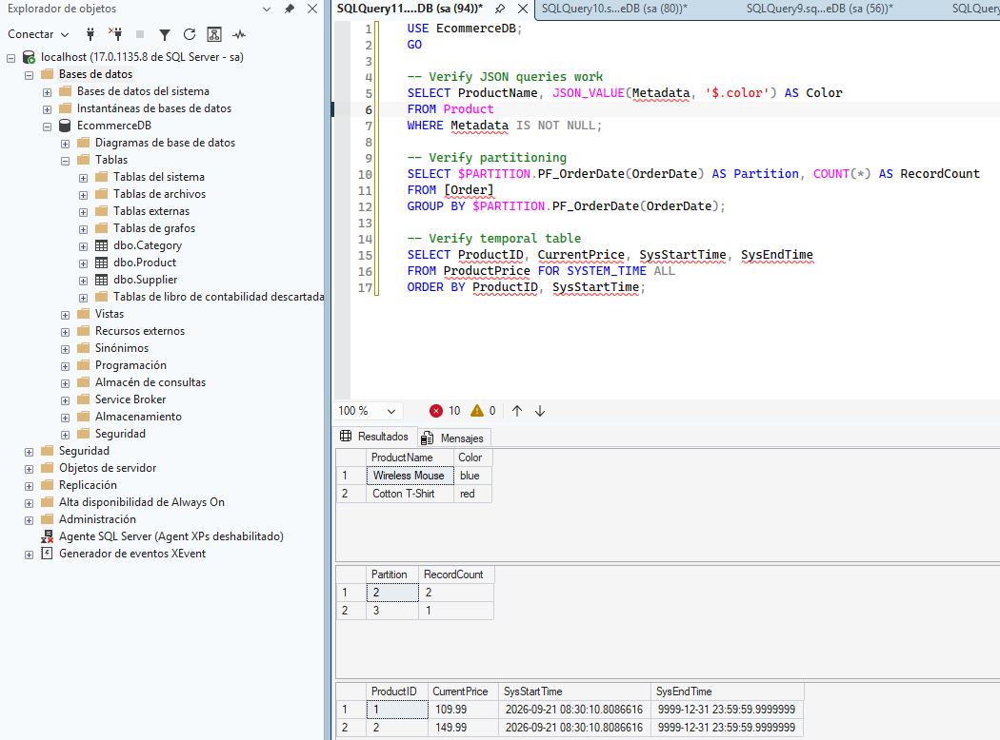
