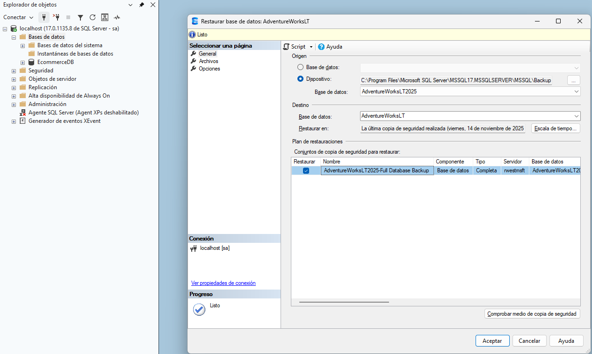
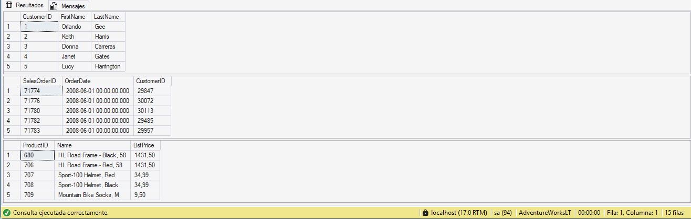
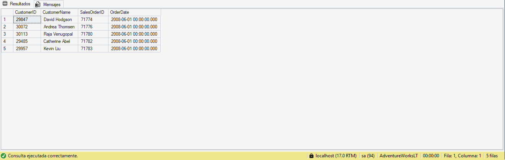
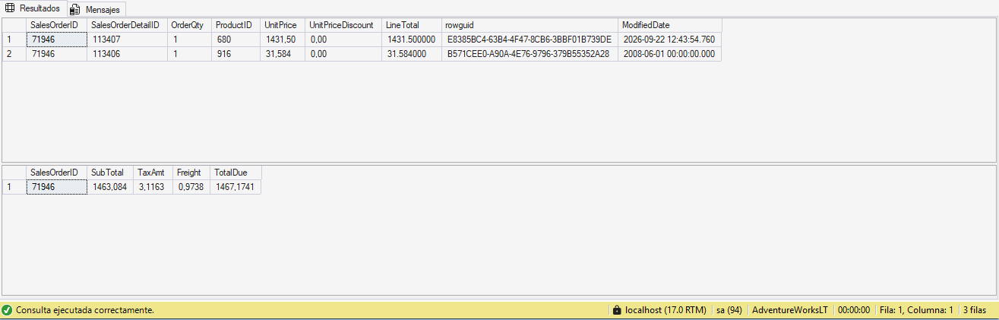
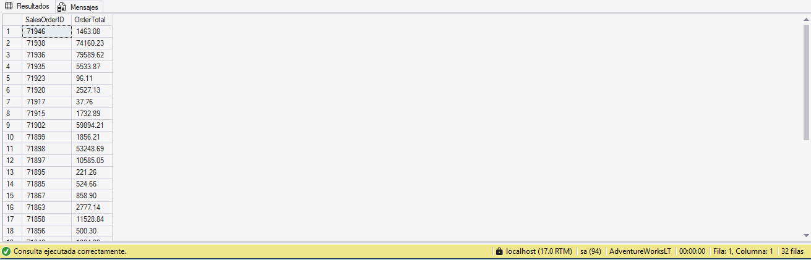
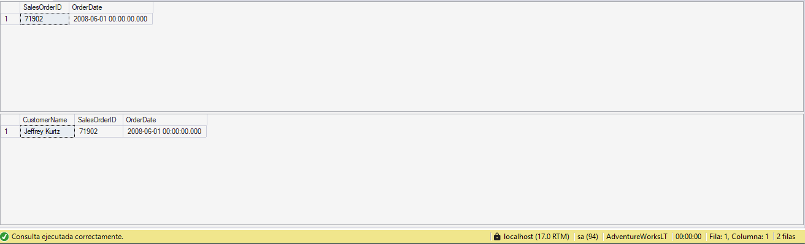
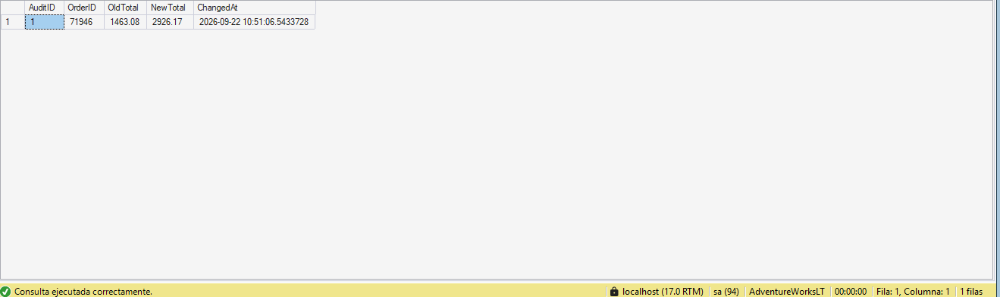

# Lab 02: Implement Programmability Objects with SQL

## Descripción y Objetivos
Implementación, optimización y validación de objetos de programabilidad en SQL Server sobre la base de datos de pruebas `AdventureWorksLT`. El objetivo de este laboratorio es encapsular la lógica de negocio en el motor relacional, desacoplar el acceso directo a tablas físicas mediante capas de abstracción, garantizar la atomicidad transaccional y automatizar auditorías sin dependencia del código de la aplicación.

---

## Prerrequisitos: Restauración de Base de Datos
Restauración del archivo de copia de seguridad oficial `AdventureWorksLT.bak` en la instancia local de SQL Server, normalizando el nombre de destino para compatibilidad con los scripts del laboratorio.



---

## 1. Verificación Inicial de Conectividad y Tablas Base
Comprobación de conectividad con la base de datos `AdventureWorksLT` y validación de permisos de lectura sobre las entidades clave del esquema `SalesLT` (`Customer`, `SalesOrderHeader` y `Product`).

```sql
USE AdventureWorksLT;
GO

SELECT TOP (5) CustomerID, FirstName, LastName 
FROM SalesLT.Customer;

SELECT TOP (5) SalesOrderID, OrderDate, CustomerID 
FROM SalesLT.SalesOrderHeader;

SELECT TOP (5) ProductID, Name, ListPrice 
FROM SalesLT.Product;
```

**Resultado:**



---

## 2. Abstracción y Simplificación con Vistas (`SalesLT.vCustomerOrders`)
Creación de una vista relacional para encapsular la complejidad de uniones `INNER JOIN` entre clientes y órdenes de compra, estandarizando el formato del nombre mediante `CONCAT()` y exponiendo una interfaz lógica desacoplada de la estructura subyacente.

```sql
USE AdventureWorksLT;
GO

CREATE OR ALTER VIEW SalesLT.vCustomerOrders AS
SELECT 
    c.CustomerID,
    CONCAT(c.FirstName, ' ', c.LastName) AS CustomerName,
    h.SalesOrderID,
    h.OrderDate
FROM SalesLT.Customer c
INNER JOIN SalesLT.SalesOrderHeader h ON c.CustomerID = h.CustomerID;
GO

-- Consulta de validación
SELECT TOP (5) * 
FROM SalesLT.vCustomerOrders 
ORDER BY OrderDate DESC;
```

**Resultado:**



---

## 3. Procedimiento Almacenado Transaccional (`dbo.AddOrderLineItem`)
Implementación de un Stored Procedure para gestionar la inserción de líneas de pedido (`SalesOrderDetail`) y el recálculo automático del subtotal en la cabecera (`SalesOrderHeader`). La lógica opera bajo control transaccional explícito (`BEGIN TRANSACTION` / `COMMIT TRANSACTION`), validación de integridad referencial y emisión de errores personalizados con `THROW`.

```sql
USE AdventureWorksLT;
GO

CREATE OR ALTER PROCEDURE dbo.AddOrderLineItem
    @SalesOrderID INT,
    @ProductID    INT,
    @Quantity     INT
AS
BEGIN
    SET NOCOUNT ON;
    BEGIN TRANSACTION;

    DECLARE @UnitPrice DECIMAL(18,2);
    SELECT @UnitPrice = CAST(ListPrice AS DECIMAL(18,2))
    FROM SalesLT.Product
    WHERE ProductID = @ProductID;

    -- Validación 1: Existencia del producto
    IF @UnitPrice IS NULL
    BEGIN
        ROLLBACK TRANSACTION;
        THROW 50010, 'Invalid ProductID specified.', 1;
    END

    -- Validación 2: Existencia del pedido
    IF NOT EXISTS (SELECT 1 FROM SalesLT.SalesOrderHeader WHERE SalesOrderID = @SalesOrderID)
    BEGIN
        ROLLBACK TRANSACTION;
        THROW 50011, 'Invalid SalesOrderID specified.', 1;
    END

    -- Inserción de la línea de detalle
    INSERT INTO SalesLT.SalesOrderDetail (SalesOrderID, OrderQty, ProductID, UnitPrice, UnitPriceDiscount)
    VALUES (@SalesOrderID, @Quantity, @ProductID, @UnitPrice, 0);

    -- Recálculo sincronizado del SubTotal en la cabecera
    UPDATE h
    SET SubTotal = d.SumLineTotal,
        ModifiedDate = SYSUTCDATETIME()
    FROM SalesLT.SalesOrderHeader h
    INNER JOIN (
        SELECT SalesOrderID, SUM(LineTotal) AS SumLineTotal
        FROM SalesLT.SalesOrderDetail
        WHERE SalesOrderID = @SalesOrderID
        GROUP BY SalesOrderID
    ) d ON d.SalesOrderID = h.SalesOrderID;

    COMMIT TRANSACTION;
END;
GO
```

**Ejecución y Prueba:**
```sql
DECLARE @SalesOrderID INT = (SELECT TOP 1 SalesOrderID 
                             FROM SalesLT.SalesOrderHeader 
                             ORDER BY SalesOrderID DESC);

EXEC dbo.AddOrderLineItem 
    @SalesOrderID = @SalesOrderID,         
    @ProductID = 680, 
    @Quantity = 1;

SELECT TOP (5) * 
FROM SalesLT.SalesOrderDetail 
WHERE SalesOrderID = @SalesOrderID 
ORDER BY SalesOrderDetailID DESC;

SELECT SalesOrderID, SubTotal, TaxAmt, Freight, TotalDue 
FROM SalesLT.SalesOrderHeader 
WHERE SalesOrderID = @SalesOrderID;
```

**Resultado:**



---

## 4. Función Escalar Determinista (`dbo.fnOrderTotal`)
Desarrollo de una Scalar Function para computar el valor acumulado de una orden a partir de sus líneas de detalle, devolviendo un único valor de tipo `DECIMAL(18,2)`. Incluye `ISNULL()` para blindar el retorno ante pedidos sin líneas asociadas.

```sql
USE AdventureWorksLT;
GO

CREATE OR ALTER FUNCTION dbo.fnOrderTotal (@OrderID INT)
RETURNS DECIMAL(18,2)
AS
BEGIN
    DECLARE @Total DECIMAL(18,2);

    SELECT @Total = SUM(LineTotal)
    FROM SalesLT.SalesOrderDetail
    WHERE SalesOrderID = @OrderID;

    RETURN ISNULL(@Total, 0.00);
END;
GO

-- Invocación dentro de una cláusula SELECT agrupada
SELECT d.SalesOrderID, dbo.fnOrderTotal(d.SalesOrderID) AS OrderTotal
FROM SalesLT.SalesOrderDetail d
GROUP BY d.SalesOrderID
ORDER BY d.SalesOrderID DESC;
```

**Resultado:**



---

## 5. Inline Table-Valued Function (ITVF) y Operador `CROSS APPLY`
Implementación de una función con valores de tabla en línea (`dbo.GetCustomerOrders`) que acepta parámetros y devuelve un result set tabular. Al ser de tipo Inline (una única instrucción `RETURN (SELECT ...)`), el optimizador expande la consulta directamente en el plan de ejecución, permitiendo la correlación fila por fila mediante `CROSS APPLY`.

```sql
USE AdventureWorksLT;
GO

CREATE OR ALTER FUNCTION dbo.GetCustomerOrders (@CustomerID INT)
RETURNS TABLE
AS
RETURN
(
    SELECT 
        h.SalesOrderID,
        h.OrderDate
    FROM SalesLT.SalesOrderHeader h
    WHERE h.CustomerID = @CustomerID
);
GO

-- Consulta correlacionada fila por fila con CROSS APPLY
SELECT 
    CONCAT(c.FirstName, ' ', c.LastName) AS CustomerName, 
    o.SalesOrderID, 
    o.OrderDate
FROM SalesLT.Customer c
CROSS APPLY dbo.GetCustomerOrders(c.CustomerID) o
WHERE c.CustomerID = 29929;
```

**Resultado:**



---

## 6. Disparador DML para Auditoría Automática (`SalesLT.trg_LogOrderTotalChange`)
Diseño de una tabla de auditoría (`dbo.OrderAudit`) y un Trigger `AFTER INSERT, UPDATE` sobre la tabla de detalle. El mecanismo intercepta modificaciones de cantidad, computa los totales previos y posteriores accediendo a las pseudotablas `deleted` e `inserted`, y registra la trazabilidad con marca de tiempo UTC (`SYSUTCDATETIME()`).

```sql
USE AdventureWorksLT;
GO

-- 1. Estructura de la tabla de auditoría
IF OBJECT_ID('dbo.OrderAudit') IS NULL
BEGIN
    CREATE TABLE dbo.OrderAudit (
        AuditID     INT IDENTITY(1,1) PRIMARY KEY,
        OrderID     INT NOT NULL,
        OldTotal    DECIMAL(18,2) NULL,
        NewTotal    DECIMAL(18,2) NULL,
        ChangedAt   DATETIME2 NOT NULL DEFAULT SYSUTCDATETIME()
    );
END;
GO

-- 2. Definición del trigger DML
CREATE OR ALTER TRIGGER SalesLT.trg_LogOrderTotalChange
ON SalesLT.SalesOrderDetail
AFTER INSERT, UPDATE
AS
BEGIN
    SET NOCOUNT ON;

    ;WITH AffectedOrders AS (
        SELECT SalesOrderID FROM inserted
        UNION
        SELECT SalesOrderID FROM deleted
    ),
    NewTotals AS (
        SELECT d.SalesOrderID, SUM(d.OrderQty * d.UnitPrice) AS Total
        FROM SalesLT.SalesOrderDetail d
        INNER JOIN AffectedOrders a ON d.SalesOrderID = a.SalesOrderID
        GROUP BY d.SalesOrderID
    ),
    InsertedTotals AS (
        SELECT SalesOrderID, SUM(OrderQty * UnitPrice) AS Total
        FROM inserted
        GROUP BY SalesOrderID
    ),
    DeletedTotals AS (
        SELECT SalesOrderID, SUM(OrderQty * UnitPrice) AS Total
        FROM deleted
        GROUP BY SalesOrderID
    )
    INSERT INTO dbo.OrderAudit (OrderID, OldTotal, NewTotal)
    SELECT
        n.SalesOrderID,
        n.Total - ISNULL(i.Total, 0) + ISNULL(d.Total, 0) AS OldTotal,
        n.Total AS NewTotal
    FROM NewTotals n
    LEFT JOIN InsertedTotals i ON n.SalesOrderID = i.SalesOrderID
    LEFT JOIN DeletedTotals d ON n.SalesOrderID = d.SalesOrderID;
END;
GO
```

**Prueba DML y Verificación del Log:**
```sql
-- Provocar la actualización para disparar el trigger
UPDATE d
SET OrderQty = OrderQty + 1
FROM SalesLT.SalesOrderDetail d
WHERE d.SalesOrderID = (SELECT TOP 1 SalesOrderID FROM SalesLT.SalesOrderHeader ORDER BY SalesOrderID DESC);

-- Consultar la auditoría generada
SELECT TOP (5) * 
FROM dbo.OrderAudit 
ORDER BY AuditID DESC;
```

**Resultado:**



---

## Consideraciones Arquitectónicas (DP-800 Alignment)
* **Vistas:** Se deben evitar vistas anidadas sobre otras vistas (*nested views*) para no entorpecer las estimaciones de cardinalidad del optimizador. Para modificaciones de datos con filtros obligatorios, se debe implementar `WITH CHECK OPTION`.
* **Procedimientos Almacenados:** Aprovechan el *Execution Plan Caching*. El uso de `SET NOCOUNT ON` es obligatorio para evitar tráfico innecesario en la red con mensajes de conteo de filas.
* **Funciones Escalares vs. ITVFs:** Las funciones escalares introducen penalizaciones de rendimiento por ejecución fila por fila (*Row-by-Row / RBAR*) al invocarse en filtros masivos. Siempre que sea posible, se deben priorizar las *Inline Table-Valued Functions*, tratadas por el optimizador como vistas parametrizadas.
* **Triggers:** Diseñados exclusivamente para auditorías transparentes o sincronización entre tablas. Su lógica debe ser minimalista para no bloquear recursos dentro de la transacción original de escritura.
