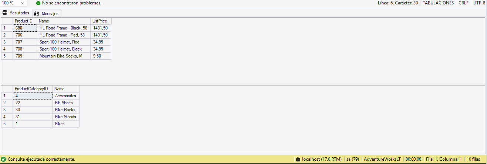
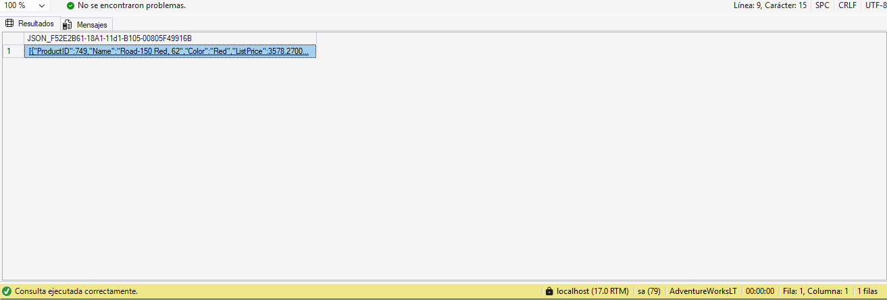
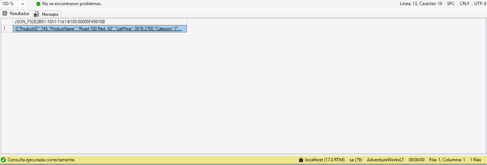
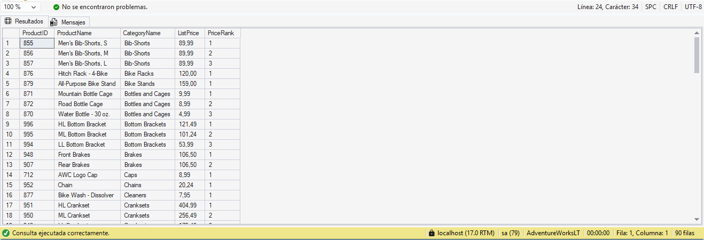
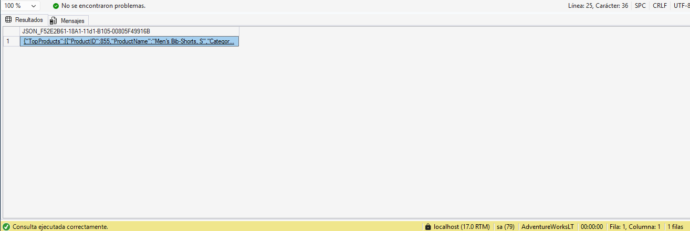
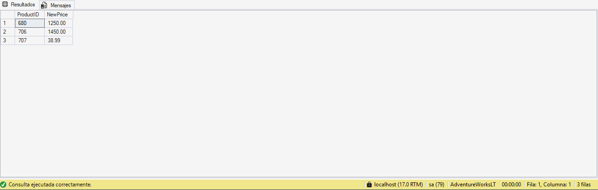
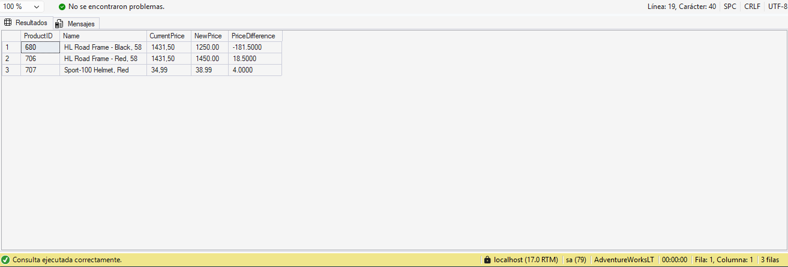

# Laboratorio 03: Trabajo con Funciones JSON y T-SQL Avanzado en SQL Server

## Metadatos y Control de Entrega
* **Módulo:** Advanced Data Processing & T-SQL
* **Entorno:** Microsoft SQL Server 2025 / SSMS v20.x
* **Base de datos:** `AdventureWorksLT`
* **Alumno:** Hugo Alcaide (`alumno02`)
* **Repositorio oficial:** [master-labs](https://github.com/HugoAlcaide/master-labs)
* **Fecha:** 23 de septiembre de 2026

---

## Objetivos del Laboratorio
1. Ejecutar operaciones analíticas y transformaciones directamente en el motor relacional mediante sintaxis basada en conjuntos (*set-based operations*).
2. Construir salidas JSON planas y estructuradas a partir de tablas relacionales mediante `FOR JSON PATH` y `JSON_OBJECT`.
3. Segmentar y clasificar catálogos de datos combinando Common Table Expressions (CTEs) y funciones de ventana (`ROW_NUMBER()` con `PARTITION BY`).
4. Ingestar y tipar colecciones semiestructuradas en memoria con `OPENJSON` y cruzarlas con tablas físicas mediante `INNER JOIN`.

---

## Desarrollo Práctico y Evidencias de Ejecución

### 1. Verificación de Conectividad y Acceso al Esquema
Comprobación inicial de lectura sobre las entidades principales del catálogo de `AdventureWorksLT`.

```sql
-- Verify key tables in AdventureWorksLT
SELECT TOP (5) ProductID, Name, ListPrice 
FROM SalesLT.Product;

SELECT TOP (5) ProductCategoryID, Name 
FROM SalesLT.ProductCategory;
```


*Evidencia 01: lectura correcta de las 5 primeras filas de productos y categorías en SSMS.*

---

### 2. Conversión a JSON Plano con `FOR JSON PATH`
Transformación de filas relacionales en un array JSON continuo de objetos, delegando la serialización en el motor relacional.

```sql
SELECT 
    ProductID,
    Name,
    Color,
    ListPrice
FROM SalesLT.Product
WHERE Color IS NOT NULL
ORDER BY ListPrice DESC
FOR JSON PATH;
```


*Evidencia 02: array JSON generado a partir de productos con atributo de color no nulo.*

---

### 3. Estructuración Jerárquica con `JSON_OBJECT`
Construcción de un objeto anidado (`Category`) que agrupa el identificador y el nombre de la categoría dentro de cada elemento de producto.

```sql
SELECT 
    p.ProductID,
    p.Name AS ProductName,
    p.ListPrice,
    JSON_OBJECT(
        'CategoryID': pc.ProductCategoryID,
        'CategoryName': pc.Name
    ) AS Category
FROM SalesLT.Product AS p
INNER JOIN SalesLT.ProductCategory AS pc
    ON p.ProductCategoryID = pc.ProductCategoryID
ORDER BY p.ListPrice DESC
FOR JSON PATH;
```


*Evidencia 03: salida JSON con la subestructura anidada Category integrada por fila.*

---

### 4. Ranking por Categoría mediante CTE y `ROW_NUMBER()`
Uso de un CTE no recursivo y la función de ventana `ROW_NUMBER()` con particionado analítico para filtrar el Top 3 de productos con mayor precio por cada categoría.

```sql
WITH RankedProducts AS (
    SELECT 
        p.ProductID,
        p.Name AS ProductName,
        pc.Name AS CategoryName,
        p.ListPrice,
        ROW_NUMBER() OVER (
            PARTITION BY pc.ProductCategoryID 
            ORDER BY p.ListPrice DESC
        ) AS PriceRank
    FROM SalesLT.Product AS p
    INNER JOIN SalesLT.ProductCategory AS pc
        ON p.ProductCategoryID = pc.ProductCategoryID
    WHERE p.ListPrice > 0
)
SELECT 
    ProductID,
    ProductName,
    CategoryName,
    ListPrice,
    PriceRank
FROM RankedProducts
WHERE PriceRank <= 3
ORDER BY CategoryName, PriceRank;
```


*Evidencia 04: cuadrícula relacional filtrando exactamente los tres productos más caros de cada categoría.*

---

### 5. Exportación del Ranking a JSON con Elemento Raíz (`ROOT`)
Envoltura del resultado analítico dentro de la clave raíz `"TopProducts"` para cumplir con especificaciones estándar de consumo en APIs REST.

```sql
WITH RankedProducts AS (
    SELECT 
        p.ProductID,
        p.Name AS ProductName,
        pc.Name AS CategoryName,
        p.ListPrice,
        ROW_NUMBER() OVER (
            PARTITION BY pc.ProductCategoryID 
            ORDER BY p.ListPrice DESC
        ) AS PriceRank
    FROM SalesLT.Product AS p
    INNER JOIN SalesLT.ProductCategory AS pc
        ON p.ProductCategoryID = pc.ProductCategoryID
    WHERE p.ListPrice > 0
)
SELECT 
    ProductID,
    ProductName,
    CategoryName,
    ListPrice,
    PriceRank
FROM RankedProducts
WHERE PriceRank <= 3
ORDER BY CategoryName, PriceRank
FOR JSON PATH, ROOT('TopProducts');
```


*Evidencia 05: payload JSON estructurado bajo la propiedad envolvente TopProducts.*

---

### 6. Parseo de JSON a Conjunto Relacional con `OPENJSON`
Conversión de un documento JSON recibido en memoria a formato tabular mediante la cláusula `WITH` con tipos de datos relacionales explícitos (`INT`, `DECIMAL`).

```sql
DECLARE @ProductUpdates NVARCHAR(MAX) = N'[
    {"ProductID": 680, "NewPrice": 1250.00},
    {"ProductID": 706, "NewPrice": 1450.00},
    {"ProductID": 707, "NewPrice": 38.99}
]';

SELECT 
    ProductID,
    NewPrice
FROM OPENJSON(@ProductUpdates)
WITH (
    ProductID INT '$.ProductID',
    NewPrice DECIMAL(10,2) '$.NewPrice'
);
```


*Evidencia 06: conjunto relacional derivado de JSON con columnas fuertemente tipadas.*

---

### 7. Integración de `OPENJSON` con Tablas Relacionales (`INNER JOIN`)
Cruce entre la tabla virtual generada por `OPENJSON` y la tabla física `SalesLT.Product` para comparar precios vigentes frente a nuevos precios y calcular la diferencia directamente en SQL Server.

```sql
DECLARE @ProductUpdates NVARCHAR(MAX) = N'[
    {"ProductID": 680, "NewPrice": 1250.00},
    {"ProductID": 706, "NewPrice": 1450.00},
    {"ProductID": 707, "NewPrice": 38.99}
]';

SELECT 
    p.ProductID,
    p.Name,
    p.ListPrice AS CurrentPrice,
    updates.NewPrice,
    updates.NewPrice - p.ListPrice AS PriceDifference
FROM SalesLT.Product AS p
INNER JOIN OPENJSON(@ProductUpdates)
WITH (
    ProductID INT '$.ProductID',
    NewPrice DECIMAL(10,2) '$.NewPrice'
) AS updates
    ON p.ProductID = updates.ProductID;
```


*Evidencia 07: cruce relacional comparando ListPrice y NewPrice con el cálculo dinámico de PriceDifference.*

---

## Conclusiones Técnicas
* **Eficiencia Set-Based:** El cálculo de rankings dentro de particiones (`ROW_NUMBER() OVER(PARTITION BY ...)`) resuelve analíticas complejas en una única pasada sobre los datos, evitando el procesamiento iterativo en la aplicación.
* **Flexibilidad Semiestructurada:** El uso combinado de `FOR JSON PATH` y `OPENJSON ... WITH` dota a SQL Server de capacidades para operar de forma híbrida entre modelos relacionales y documentos JSON sin penalizaciones de mapeo ORM.
