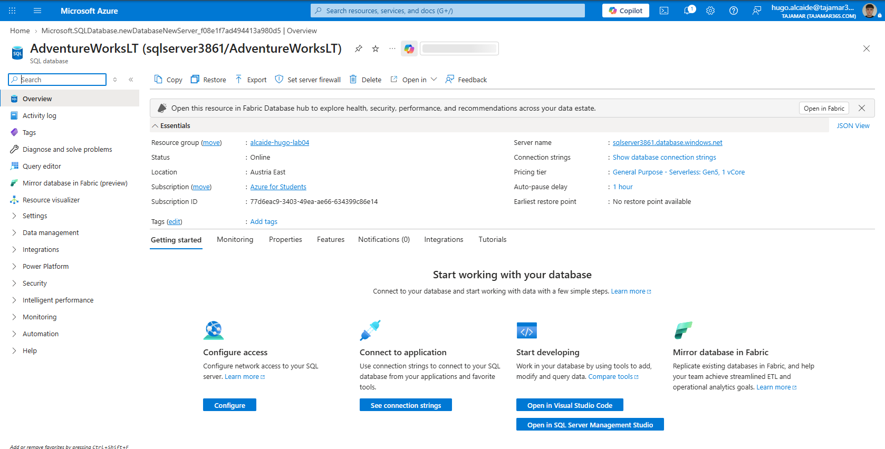
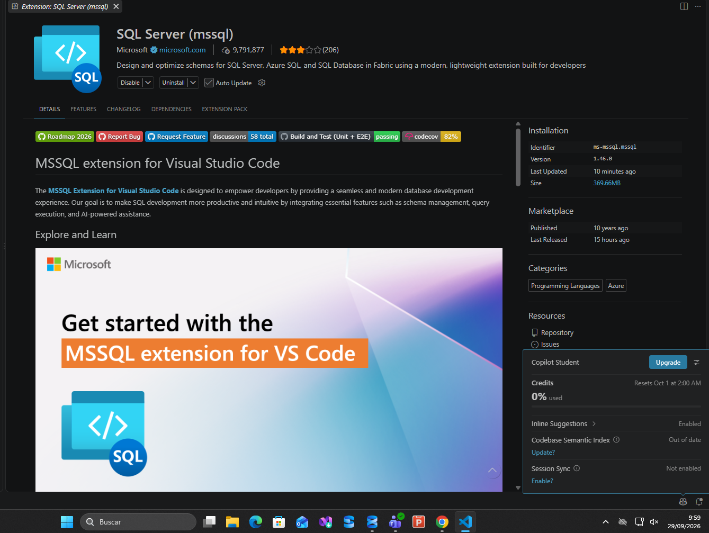
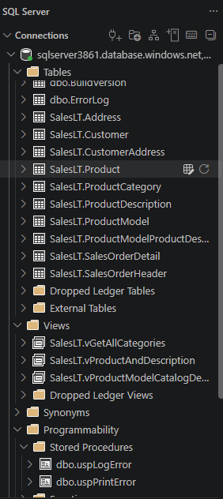
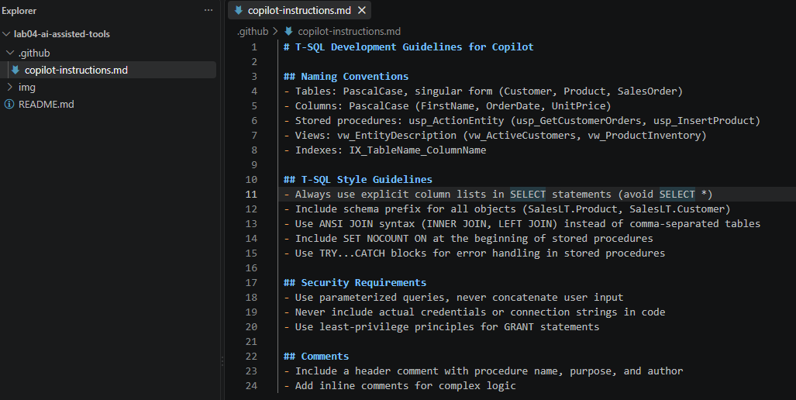
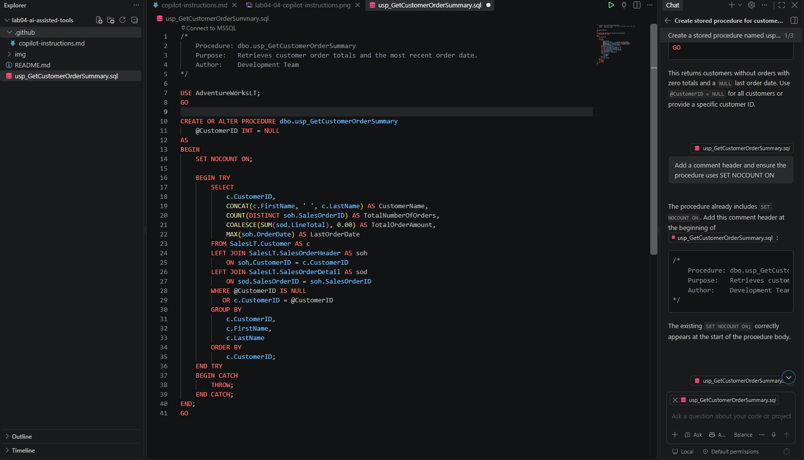
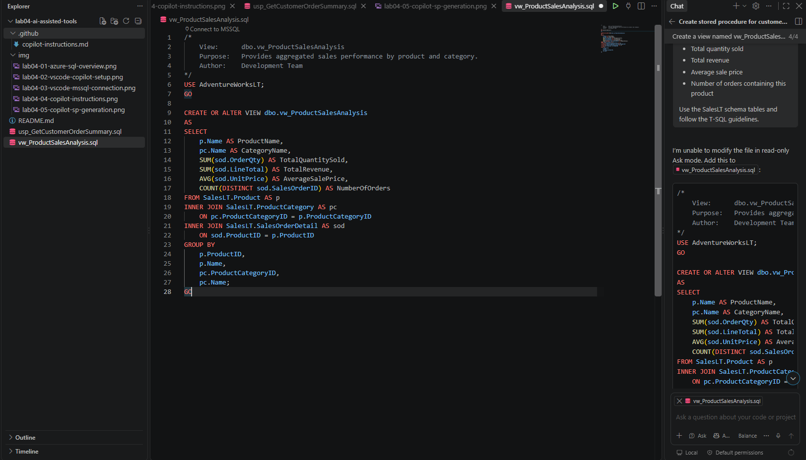
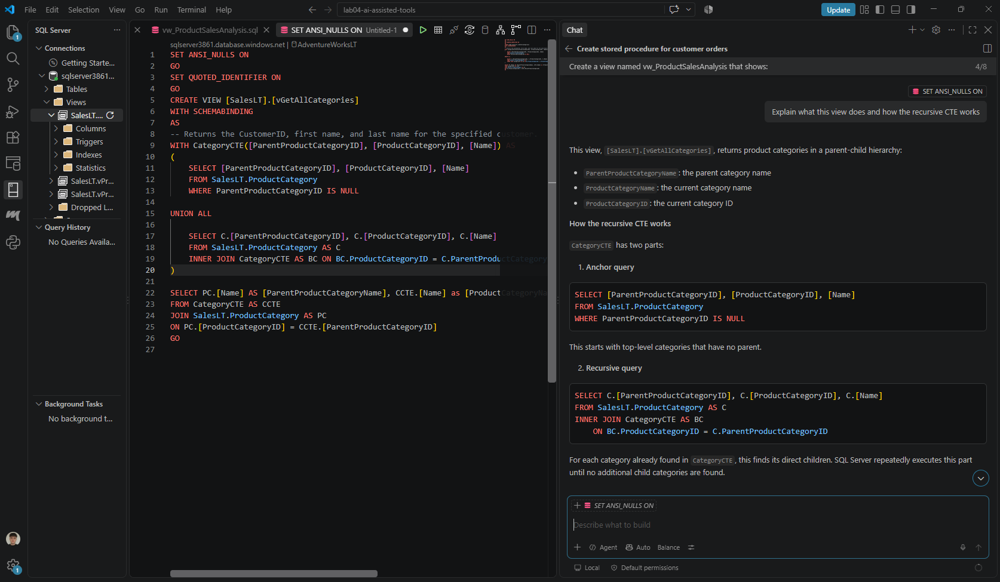
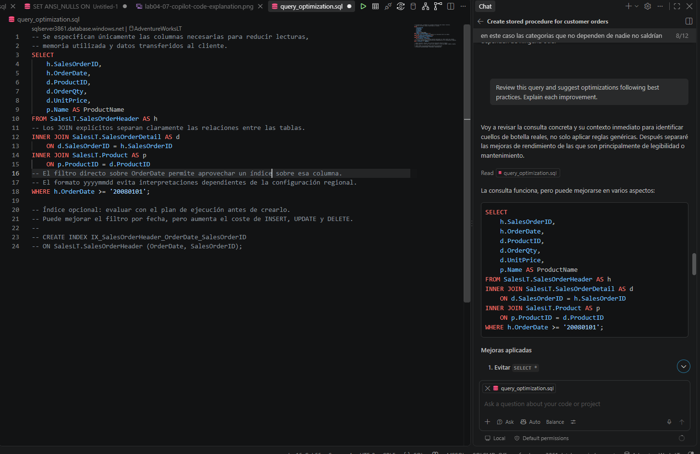
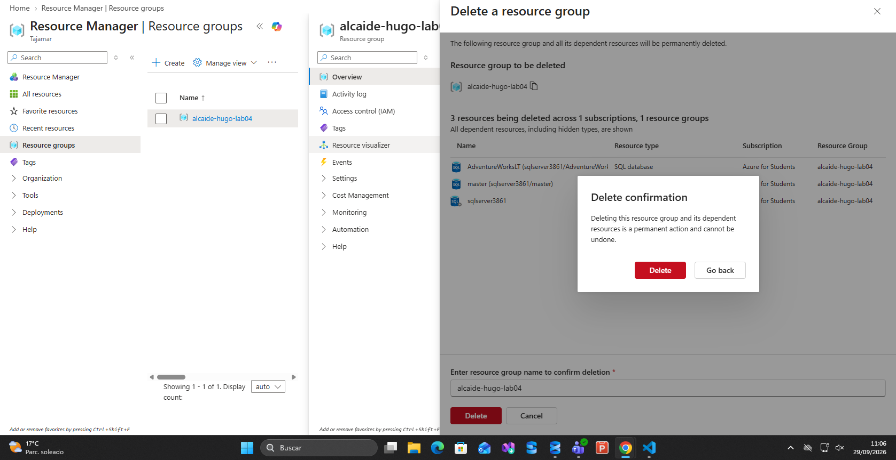

# Laboratorio 04: Implementación de Soluciones SQL Mediante Herramientas Asistidas por IA

## Metadatos y Ficha Técnica del Proyecto

* **Programa:** Máster en Big Data, Cloud & Inteligencia Artificial
* **Módulo Oficial:** Design and Implement SQL Solutions using AI-Assisted Tools (DP-800 / Fabric Track)
* **Entorno de Trabajo:** Visual Studio Code (v1.93+), Azure SQL Database (Serverless Gen5), SQL Server (mssql extension v1.46.0)
* **Herramientas de IA:** GitHub Copilot, GitHub Copilot Chat (Agent Mode / Ask Mode), Model Context Protocol (MCP)
* **Instancia SQL:** `sqlserver3861.database.windows.net` | Base de Datos: `AdventureWorksLT`
* **Grupo de Recursos Azure:** `alcaide-hugo-lab04`
* **Repositorio Oficial:** [master-labs](https://github.com/halca/master-labs)
* **Ubicación en Repositorio:** `lab04-ai-assisted-tools/`

---

## 1. Introducción y Enfoque de Ingeniería

El desarrollo relacional tradicional en entornos empresariales exige una inversión considerable de tiempo en la escritura de código repetitivo (*boilerplate code*), verificación manual de esquemas en diccionarios de datos y optimización reactiva de planes de ejecución. 

Este laboratorio tiene como objetivo integrar **GitHub Copilot** en el ciclo de vida del desarrollo T-SQL sobre **Azure SQL Database**, pasando de un modelo de generación ciega a un marco riguroso de **Human-in-the-Loop**. Mediante el uso de directivas centralizadas de gobernanza (`.github/copilot-instructions.md`), forzamos al asistente a respetar estándares corporativos de calidad, rendimiento y seguridad: uso estricto de esquemas explícitos, eliminación de antipatrones como `SELECT *`, manejo transaccional robusto y prevención proactiva de inyecciones SQL.

```text
┌─────────────────┐       ┌─────────────────┐       ┌─────────────────┐       ┌─────────────────┐
│  Write prompt   │  ───> │  Context sent   │  ───> │   AI generates  │  ───> │   Review and    │
│     or code     │       │     to AI       │       │    suggestion   │       │     accept      │
└─────────────────┘       └─────────────────┘       └─────────────────┘       └─────────────────┘
```

---

## 2. Paso a Paso del Laboratorio

### Paso 01: Aprovisionamiento de Azure SQL Database (`AdventureWorksLT`)

Para disponer de un modelo relacional rico sobre el que interactuar, se aprovisionó una base de datos **Azure SQL Database** utilizando el juego de datos de prueba oficial de Microsoft (`AdventureWorksLT`).

1. Se creó un grupo de recursos dedicado denominado `alcaide-hugo-lab04` en la región *Austria East*.
2. Se desplegó un servidor lógico `sqlserver3861.database.windows.net` bajo autenticación nativa SQL.
3. Se configuró el nivel de cómputo en **General Purpose - Serverless: Gen5 (1 vCore)** con auto-pausa configurada en 1 hora para optimizar costes (*FinOps*).
4. En las opciones de red, se habilitó el *Public Endpoint*, autorizando tanto a los servicios internos de Azure como la dirección IP cliente local a través del firewall del servidor.
5. En la configuración de datos adicionales, se seleccionó el origen **Sample**, precargando las tablas del esquema transaccional `SalesLT`.


*Figura 1: Visión general en Azure Portal validando el despliegue del servidor lógico sqlserver3861 y la base de datos AdventureWorksLT en estado Online.*

---

### Paso 02: Configuración del Entorno VS Code y Extensiones de IA

El entorno de desarrollo local se preparó sobre **Visual Studio Code**, integrando los componentes que permiten dotar a la IA de conocimiento contextual de base de datos.

1. Se instaló la extensión **SQL Server (mssql)** de Microsoft (versión 1.46.0), diseñada para interactuar con motores SQL Server locales, Azure SQL y Microsoft Fabric.
2. Se habilitaron las extensiones oficiales **GitHub Copilot** y **GitHub Copilot Chat**.
3. Se autenticó la sesión del editor mediante la cuenta de GitHub vinculada al perfil académico (*Copilot Student*), habilitando el motor de sugerencias contextuales (*Inline Suggestions Enabled*).


*Figura 2: Extensión SQL Server (mssql) instalada y sesión de GitHub Copilot activa en el entorno de desarrollo.*

---

### Paso 03: Conexión TDS Directa e Inspección del Catálogo Relacional

Se estableció la conexión directa entre el editor y la instancia en la nube para permitir que el asistente inspeccione los esquemas relacionales reales.

1. En el panel de **SQL Server**, se añadió una nueva conexión hacia `sqlserver3861.database.windows.net`.
2. Se utilizó la autenticación SQL estándar especificando el catálogo inicial `AdventureWorksLT` y habilitando el cifrado con `Trust server certificate: True`.
3. Una vez establecida la sesión, se navegó por el árbol de objetos comprobando la presencia de las tablas maestras (`SalesLT.Customer`, `SalesLT.Product`) y de detalle (`SalesLT.SalesOrderDetail`, `SalesLT.SalesOrderHeader`), así como las vistas del sistema.


*Figura 3: Árbol de navegación de la base de datos AdventureWorksLT mostrando el catálogo de tablas del esquema SalesLT.*

---

### Paso 04: Definición de Directivas de Gobernanza (`.github/copilot-instructions.md`)

Para evitar que el modelo de lenguaje produzca código con malas prácticas o desconectado de los estándares del equipo, se implementó un archivo de instrucciones de repositorio dentro del directorio `.github/`. 

Copilot analiza este archivo Markdown automáticamente en cada consulta dentro del espacio de trabajo:

```markdown
# T-SQL Development Guidelines for Copilot

## Naming Conventions
- Tables: PascalCase, singular form (Customer, Product, SalesOrder)
- Columns: PascalCase (FirstName, OrderDate, UnitPrice)
- Stored procedures: usp_ActionEntity (usp_GetCustomerOrders, usp_InsertProduct)
- Views: vw_EntityDescription (vw_ActiveCustomers, vw_ProductInventory)
- Indexes: IX_TableName_ColumnName

## T-SQL Style Guidelines
- Always use explicit column lists in SELECT statements (avoid SELECT *)
- Include schema prefix for all objects (SalesLT.Product, SalesLT.Customer)
- Use ANSI JOIN syntax (INNER JOIN, LEFT JOIN) instead of comma-separated tables
- Include SET NOCOUNT ON at the beginning of stored procedures
- Use TRY...CATCH blocks for error handling in stored procedures

## Security Requirements
- Use parameterized queries, never concatenate user input
- Never include actual credentials or connection strings in code
- Use least-privilege principles for GRANT statements

## Comments
- Include a header comment with procedure name, purpose, and author
- Add inline comments for complex logic
```


*Figura 4: Estructura del repositorio mostrando .github/copilot-instructions.md con las reglas de estilo y seguridad T-SQL.*

---

### Paso 05: Generación Asistida de Procedimiento Almacenado (`usp_GetCustomerOrderSummary.sql`)

Se solicitó a Copilot en modo conversacional la creación de un procedimiento analítico que consolidara métricas de cliente, validando si aplicaba de forma autónoma las directivas recién creadas.

**Prompt emitido:**
> *"Create a stored procedure named usp_GetCustomerOrderSummary that retrieves customer order information from the AdventureWorksLT database. The procedure should:*
> *- Accept a @CustomerID parameter (optional, if NULL return all customers)*
> *- Return customer name, total number of orders, total order amount, and last order date*
> *- Join SalesLT.Customer, SalesLT.SalesOrderHeader, and SalesLT.SalesOrderDetail tables*
> *- Include error handling with TRY...CATCH*
> *- Follow the T-SQL guidelines in the instruction file"*

Tras una iteración menor solicitando encabezado formal de documentación y directiva `SET NOCOUNT ON;`, el asistente entregó la solución completa:

```sql
/*
    Procedure: dbo.usp_GetCustomerOrderSummary
    Purpose:   Retrieves customer order totals and the most recent order date.
    Author:    Development Team
*/

USE AdventureWorksLT;
GO

CREATE OR ALTER PROCEDURE dbo.usp_GetCustomerOrderSummary
    @CustomerID INT = NULL
AS
BEGIN
    SET NOCOUNT ON;

    BEGIN TRY
        SELECT
            c.CustomerID,
            CONCAT(c.FirstName, ' ', c.LastName) AS CustomerName,
            COUNT(DISTINCT soh.SalesOrderID) AS TotalNumberOfOrders,
            COALESCE(SUM(sod.LineTotal), 0.00) AS TotalOrderAmount,
            MAX(soh.OrderDate) AS LastOrderDate
        FROM SalesLT.Customer AS c
        LEFT JOIN SalesLT.SalesOrderHeader AS soh
            ON soh.CustomerID = c.CustomerID
        LEFT JOIN SalesLT.SalesOrderDetail AS sod
            ON sod.SalesOrderID = soh.SalesOrderID
        WHERE @CustomerID IS NULL
           OR c.CustomerID = @CustomerID
        GROUP BY
            c.CustomerID,
            c.FirstName,
            c.LastName
        ORDER BY
            c.CustomerID;
    END TRY
    BEGIN CATCH
        THROW;
    END CATCH;
END;
GO
```

**Evaluación técnica del código generado:**
* **Gobernanza:** Cumple la convención `usp_`, incluye esquema `dbo.` y aplica `SET NOCOUNT ON;` para suprimir mensajes de recuento de filas que degradan el ancho de banda de red.
* **Integridad analítica:** Emplea `LEFT JOIN` para no descartar a los clientes sin historial de compras y protege los importes monetarios mediante `COALESCE(SUM(...), 0.00)`.
* **Resiliencia:** Incorpora un bloque estructurado `BEGIN TRY ... END TRY` con propagación limpia de excepciones vía `THROW;`.


*Figura 5: Interacción con Copilot Chat y script final dbo.usp_GetCustomerOrderSummary respetando las directivas corporativas.*

---

### Paso 06: Generación Asistida de Vista Analítica (`vw_ProductSalesAnalysis.sql`)

El siguiente requerimiento consistió en generar una vista relacional para exponer métricas agregadas de rendimiento de producto hacia herramientas de BI o reporting.

**Prompt emitido:**
> *"Create a view named vw_ProductSalesAnalysis that shows:*
> *- Product name and category*
> *- Total quantity sold*
> *- Total revenue*
> *- Average sale price*
> *- Number of orders containing this product*
> 
> *Use the SalesLT schema tables and follow the T-SQL guidelines."*

El código generado en `vw_ProductSalesAnalysis.sql` fue el siguiente:

```sql
/*
    View:    dbo.vw_ProductSalesAnalysis
    Purpose: Provides aggregated sales performance by product and category.
    Author:  Development Team
*/

USE AdventureWorksLT;
GO

CREATE OR ALTER VIEW dbo.vw_ProductSalesAnalysis
AS
SELECT
    p.Name AS ProductName,
    pc.Name AS CategoryName,
    SUM(sod.OrderQty) AS TotalQuantitySold,
    SUM(sod.LineTotal) AS TotalRevenue,
    AVG(sod.UnitPrice) AS AverageSalePrice,
    COUNT(DISTINCT sod.SalesOrderID) AS NumberOfOrders
FROM SalesLT.Product AS p
INNER JOIN SalesLT.ProductCategory AS pc
    ON pc.ProductCategoryID = p.ProductCategoryID
INNER JOIN SalesLT.SalesOrderDetail AS sod
    ON sod.ProductID = p.ProductID
GROUP BY
    p.ProductID,
    p.Name,
    pc.ProductCategoryID,
    pc.Name;
GO
```

**Evaluación técnica:**
* Respetó el prefijo `vw_` exigido en las directivas.
* Evitó el uso de `SELECT *`, proyectando únicamente las métricas requeridas.
* Implementó uniones basadas en el estándar ANSI (`INNER JOIN`) relacionando correctamente las jerarquías de categorías y líneas de venta.


*Figura 6: Generación y validación de la vista relacional dbo.vw_ProductSalesAnalysis en VS Code.*

---

### Paso 07: Explicación de Código Complejo y Common Table Expressions (CTE)

Para validar la capacidad de Copilot en tareas de ingeniería inversa y documentación técnica, se tomó la vista de sistema `SalesLT.vGetAllCategories`, la cual implementa un CTE recursivo para aplanar árboles jerárquicos de categorías padre e hijo.

Se seleccionó el código completo y se ejecutó la consulta:

**Prompt emitido:**
> *"Explain what this view does and how the recursive CTE works"*


*Figura 7: Desglose analítico de Copilot Chat explicando el Anchor Member y el Recursive Member de SalesLT.vGetAllCategories.*

**Desglose conceptual obtenido:**
Copilot identificó con precisión matemática los dos componentes esenciales de la recursión en el motor relacional:
1. **Anchor Query (Miembro Ancla):** Consulta inicial que filtra las categorías raíz donde `ParentProductCategoryID IS NULL`, asignándoles el nivel base.
2. **UNION ALL:** Operador obligatorio que une las filas base con las sucesivas iteraciones de profundidad.
3. **Recursive Query (Miembro Recursivo):** Subconsulta que une `SalesLT.ProductCategory` consigo misma a través de la referencia al propio CTE (`CategoryCTE AS BC`), descendiendo de forma iterativa por el árbol de dependencias hasta que no existen más niveles jerárquicos hijos.

---

### Paso 08: Análisis Estático y Optimización de Consultas (`query_optimization.sql`)

En esta etapa se confrontó a Copilot con una consulta deliberadamente deficiente que contenía múltiples antipatrones de rendimiento y legibilidad.

#### Consulta Original (Sin Optimizar)
```sql
SELECT *
FROM SalesLT.SalesOrderHeader h, SalesLT.SalesOrderDetail d, SalesLT.Product p
WHERE h.SalesOrderID = d.SalesOrderID
AND d.ProductID = p.ProductID
AND h.OrderDate > '2008-01-01'
```

**Prompt de optimización:**
> *"Review this query and suggest optimizations following best practices. Explain each improvement."*

#### Consulta Optimizada Sugerida por Copilot
```sql
-- Se especifican únicamente las columnas necesarias para reducir lecturas,
-- memoria utilizada y datos transferidos al cliente.
SELECT
    h.SalesOrderID,
    h.OrderDate,
    d.ProductID,
    d.OrderQty,
    d.UnitPrice,
    p.Name AS ProductName
FROM SalesLT.SalesOrderHeader AS h
-- Los JOIN explícitos separan claramente las relaciones entre las tablas.
INNER JOIN SalesLT.SalesOrderDetail AS d
    ON d.SalesOrderID = h.SalesOrderID
INNER JOIN SalesLT.Product AS p
    ON p.ProductID = d.ProductID
-- El formato YYYYMMDD evita interpretaciones dependientes de la configuración regional.
WHERE h.OrderDate >= '20080101';

-- Índice opcional: evaluar con el plan de ejecución antes de crearlo.
-- Puede mejorar el filtro por fecha, pero aumenta el coste de INSERT, UPDATE y DELETE.
-- CREATE INDEX IX_SalesOrderHeader_OrderDate_SalesOrderID
-- ON SalesLT.SalesOrderHeader (OrderDate, SalesOrderID);
```


*Figura 8: Análisis estático en Copilot Chat identificando antipatrones y proponiendo la reescritura optimizada de query_optimization.sql.*

#### Justificación Técnica de las Mejoras
1. **Reemplazo de Comma Joins por ANSI SQL (`INNER JOIN ... ON`):** Las uniones implícitas en el `WHERE` son propensas a errores humanos y pueden derivar accidentalmente en productos cartesianos (`CROSS JOIN`). La sintaxis ANSI separa la lógica de relación de tablas de los predicados de filtrado.
2. **Eliminación del Antipatrón `SELECT *`:** La proyección explícita reduce las lecturas lógicas en disco, optimiza el consumo de memoria en el *Buffer Pool* y permite al optimizador de consultas aprovechar índices cubrientes (*Covering Indexes*).
3. **Formato de Fecha No Dependiente del Idioma (`YYYYMMDD`):** La sustitución del literal `'2008-01-01'` por `'20080101'` garantiza que la consulta sea determinista sin importar el `DATEFORMAT` o la intercalación (*collation*) de la sesión.
4. **Propuesta de Indexación:** Se sugiere evaluar un índice no agrupado sobre `OrderDate` para transformar un escaneo completo de tabla (*Clustered Index Scan*) en una búsqueda puntual por rango (*Index Seek*).

---

### Paso 09: Limpieza de Recursos y FinOps

En cumplimiento de las buenas prácticas de gobernanza en la nube y optimización de costes, se procedió a desaprovisionar todos los recursos creados.

1. Se accedió al grupo de recursos `alcaide-hugo-lab04` en Azure Portal.
2. Se confirmó la eliminación destruyendo simultáneamente el servidor lógico `sqlserver3861`, la base de datos `AdventureWorksLT` y la base de datos maestra `master`.


*Figura 9: Panel modal en Azure Portal confirmando la destrucción permanente del grupo de recursos alcaide-hugo-lab04.*

---

## 3. Conclusiones y Aprendizajes Clave

1. **La IA como copiloto, no piloto automático:** Las herramientas como GitHub Copilot aceleran drásticamente la generación de código, pero su utilidad radica en la capacidad del ingeniero de formular requerimientos precisos y auditar críticamente los planes resultantes.
2. **Importancia de los archivos de gobernanza:** La presencia del archivo `.github/copilot-instructions.md` actúa como un *prompt system* continuo que evita inconsistencias de nomenclatura, fugas de memoria o código inseguro antes de que llegue a producción.
3. **Model Context Protocol (MCP):** La evolución natural de estas herramientas reside en conectar el LLM en vivo con el motor SQL mediante MCP, permitiéndole verificar estadísticas, índices y cardinalidades reales sin limitarse al código visible en pantalla.