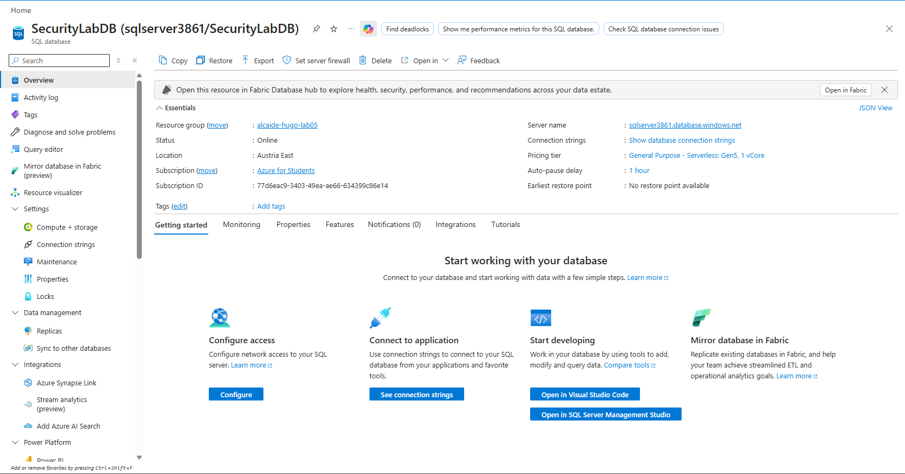
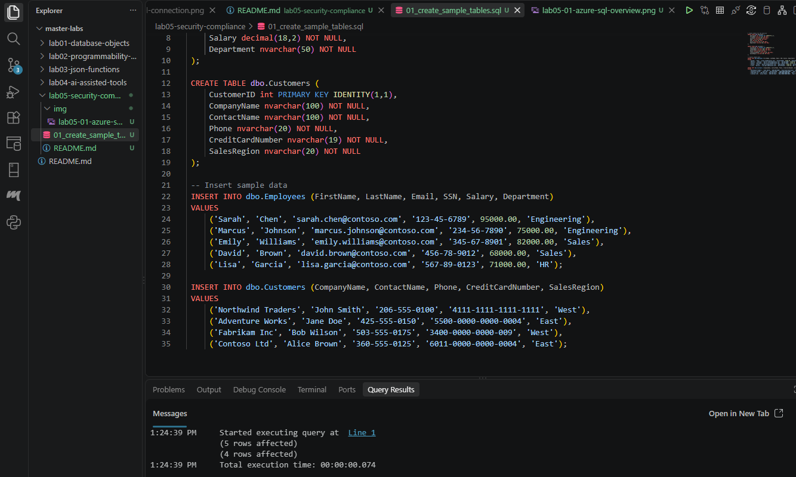
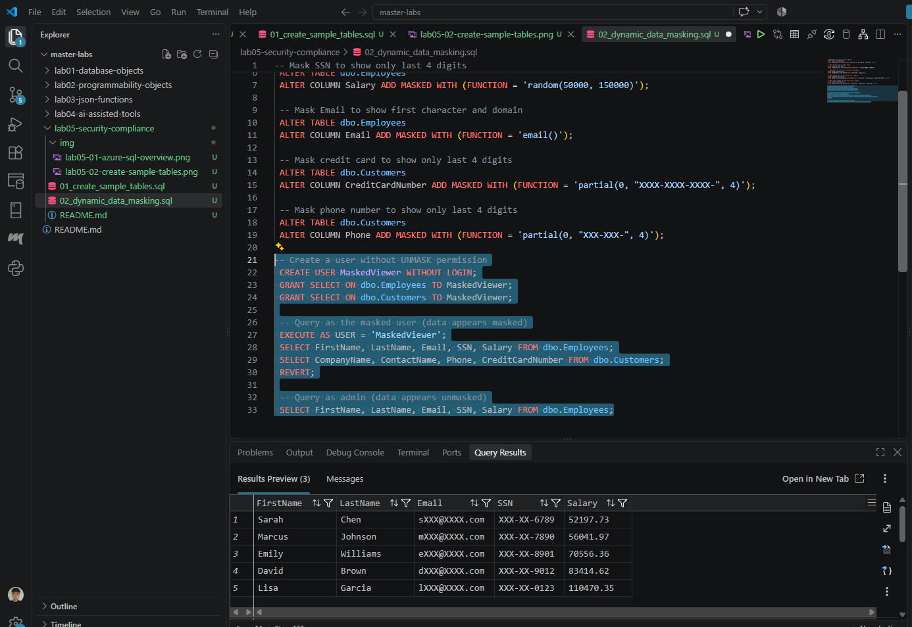
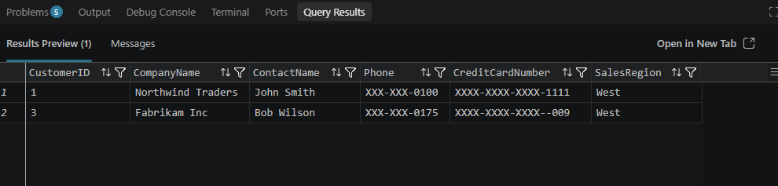
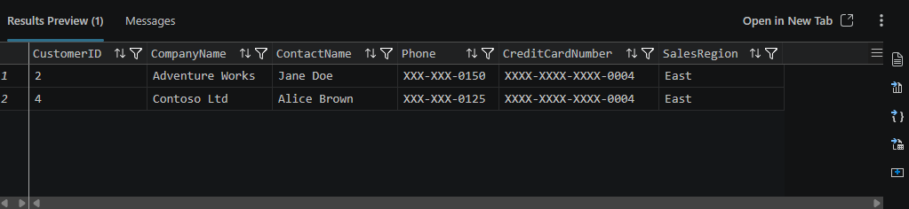
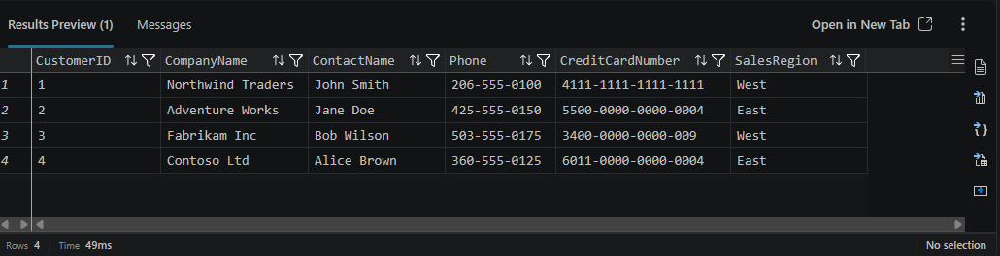
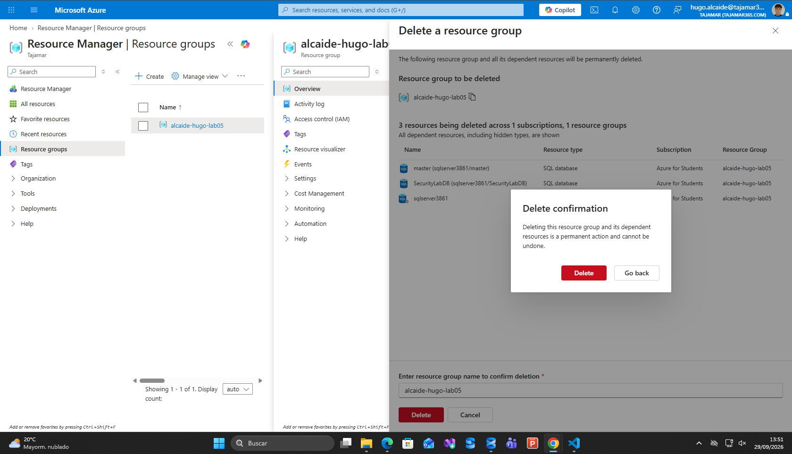

# Laboratorio 05: Implementación de Seguridad y Cumplimiento con SQL en Azure

Este laboratorio aborda el diseño e implementación de controles de seguridad de base de datos bajo el principio de **Defense-in-Depth** en **Azure SQL Database**. Se implementan mecanismos de protección de datos en la capa de presentación mediante **Dynamic Data Masking (DDM)** para prevenir la exposición indebida de Información de Identificación Personal (PII) y datos financieros, junto con políticas de aislamiento horizontal mediante **Row-Level Security (RLS)** para restringir el acceso a los registros en función de la identidad del usuario sin requerir cambios en el código de la aplicación.

---

## Metadatos y Ficha Técnica del Proyecto

* **Estudiante:** Hugo Alcaide Martínez
* **Usuario GitHub:** [HugoAlcaide](https://github.com/HugoAlcaide)
* **Entorno de Ejecución:** Azure SQL Database (Logical Server: `sqlserver3861.database.windows.net`, Database: `SecurityLabDB`)
* **Nivel de Servicio (Tier):** General Purpose - Serverless (Compute auto-pause activado)
* **Herramientas Utilizadas:** Visual Studio Code, extensión MSSQL, Azure Portal
* **Fecha:** Septiembre de 2026

---

## Estructura del Repositorio

La arquitectura del directorio del laboratorio mantiene segregados los scripts T-SQL de las capturas de pantalla de evidencia técnica:

```text
lab05-security-compliance/
├── img/
│   ├── lab05-01-azure-sql-overview.png
│   ├── lab05-02-create-sample-tables.png
│   ├── lab05-03-dynamic-data-masking.png
│   ├── lab05-04a-rls-west-test.png
│   ├── lab05-04b-rls-east-test.png
│   ├── lab05-04c-rls-admin-test.png
│   └── lab05-05-cleanup-rg-deleted.png
├── 01_create_sample_tables.sql
├── 02_dynamic_data_masking.sql
├── 03_row_level_security.sql
├── 04_cleanup.sql
└── README.md
```

---

## Fase 1: Aprovisionamiento de la Base de Datos en Azure

Se desplegó un servidor lógico relacional junto a la base de datos `SecurityLabDB` dentro del grupo de recursos `alcaide-hugo-lab05` en la región **Austria East**. Se seleccionó la modalidad **Serverless** para optimizar el cómputo y minimizar los costes mediante auto-pausa durante periodos de inactividad.

* **Seguridad de Red:** Se habilitó el punto de conexión público (*Public endpoint*) configurando reglas de firewall para permitir el tráfico procedente de servicios internos de Azure y la dirección IP pública del entorno local de desarrollo.



---

## Fase 2: Creación de Tablas de Muestra y Carga de Datos

Archivo T-SQL: [`01_create_sample_tables.sql`](01_create_sample_tables.sql)

Se crearon dos tablas en el esquema estándar `dbo` que contienen datos sensibles de negocio:
1. `dbo.Employees`: Almacena información de empleados con columnas sensibles como correo electrónico (`Email`), número de seguridad social (`SSN`) y compensación salarial (`Salary`).
2. `dbo.Customers`: Contiene información de cuentas comerciales, registros de contacto, número de tarjeta de crédito (`CreditCardNumber`) y segmentación geográfica (`SalesRegion`).

### Contenido completo de `01_create_sample_tables.sql`

```sql
 -- Create tables for the exercise
 CREATE TABLE dbo.Employees (
     EmployeeID int PRIMARY KEY IDENTITY(1,1),
     FirstName nvarchar(50) NOT NULL,
     LastName nvarchar(50) NOT NULL,
     Email nvarchar(100) NOT NULL,
     SSN char(11) NOT NULL,
     Salary decimal(18,2) NOT NULL,
     Department nvarchar(50) NOT NULL
 );

 CREATE TABLE dbo.Customers (
     CustomerID int PRIMARY KEY IDENTITY(1,1),
     CompanyName nvarchar(100) NOT NULL,
     ContactName nvarchar(100) NOT NULL,
     Phone nvarchar(20) NOT NULL,
     CreditCardNumber nvarchar(19) NOT NULL,
     SalesRegion nvarchar(20) NOT NULL
 );

 -- Insert sample data
 INSERT INTO dbo.Employees (FirstName, LastName, Email, SSN, Salary, Department)
 VALUES 
     ('Sarah', 'Chen', 'sarah.chen@contoso.com', '123-45-6789', 95000.00, 'Engineering'),
     ('Marcus', 'Johnson', 'marcus.johnson@contoso.com', '234-56-7890', 75000.00, 'Engineering'),
     ('Emily', 'Williams', 'emily.williams@contoso.com', '345-67-8901', 82000.00, 'Sales'),
     ('David', 'Brown', 'david.brown@contoso.com', '456-78-9012', 68000.00, 'Sales'),
     ('Lisa', 'Garcia', 'lisa.garcia@contoso.com', '567-89-0123', 71000.00, 'HR');

 INSERT INTO dbo.Customers (CompanyName, ContactName, Phone, CreditCardNumber, SalesRegion)
 VALUES
     ('Northwind Traders', 'John Smith', '206-555-0100', '4111-1111-1111-1111', 'West'),
     ('Adventure Works', 'Jane Doe', '425-555-0150', '5500-0000-0000-0004', 'East'),
     ('Fabrikam Inc', 'Bob Wilson', '503-555-0175', '3400-0000-0000-009', 'West'),
     ('Contoso Ltd', 'Alice Brown', '360-555-0125', '6011-0000-0000-0004', 'East');
```

En la verificación inicial, las consultas devuelven los valores sin ningún tipo de transformación u ofuscación criptográfica:



---

## Fase 3: Implementación de Dynamic Data Masking (DDM)

Archivo T-SQL: [`02_dynamic_data_masking.sql`](02_dynamic_data_masking.sql)

**Dynamic Data Masking** permite ofuscar la salida de datos sensibles en tiempo de ejecución para usuarios sin privilegios específicos, preservando la integridad de los datos originales almacenados en el disco.

Se aplicaron directivas de máscara sobre columnas críticas empleando las siguientes funciones:
* `partial(0, "XXX-XX-", 4)`: Expone únicamente los últimos 4 caracteres (utilizado para el SSN).
* `random(50000, 150000)`: Genera un valor numérico aleatorio plausible en el rango salarial especificado en cada consulta.
* `email()`: Oculta el nombre de usuario de la cuenta exponiendo solo la primera letra y la terminación de dominio (`sXXX@XXXX.com`).
* `partial(0, "XXXX-XXXX-XXXX-", 4)`: Oculta los primeros doce dígitos del número de tarjeta de crédito.
* `partial(0, "XXX-XXX-", 4)`: Oculta los dígitos iniciales del número telefónico.

Para validar el aislamiento de la información, se creó el usuario `MaskedViewer` (sin credencial de login y sin el permiso `UNMASK`) y se comprobó que los datos se muestran ofuscados bajo su contexto, mientras que la cuenta administradora visualiza la información real mediante la cláusula `REVERT`.

### Contenido completo de `02_dynamic_data_masking.sql`

```sql
 -- Mask SSN to show only last 4 digits
 ALTER TABLE dbo.Employees
 ALTER COLUMN SSN ADD MASKED WITH (FUNCTION = 'partial(0, "XXX-XX-", 4)');

 -- Mask Salary with a random value
 ALTER TABLE dbo.Employees
 ALTER COLUMN Salary ADD MASKED WITH (FUNCTION = 'random(50000, 150000)');

 -- Mask Email to show first character and domain
 ALTER TABLE dbo.Employees
 ALTER COLUMN Email ADD MASKED WITH (FUNCTION = 'email()');

 -- Mask credit card to show only last 4 digits
 ALTER TABLE dbo.Customers
 ALTER COLUMN CreditCardNumber ADD MASKED WITH (FUNCTION = 'partial(0, "XXXX-XXXX-XXXX-", 4)');

 -- Mask phone number to show only last 4 digits
 ALTER TABLE dbo.Customers
 ALTER COLUMN Phone ADD MASKED WITH (FUNCTION = 'partial(0, "XXX-XXX-", 4)');

 -- Create a user without UNMASK permission
 CREATE USER MaskedViewer WITHOUT LOGIN;
 GRANT SELECT ON dbo.Employees TO MaskedViewer;
 GRANT SELECT ON dbo.Customers TO MaskedViewer;

 -- Query as the masked user (data appears masked)
 EXECUTE AS USER = 'MaskedViewer';
 SELECT FirstName, LastName, Email, SSN, Salary FROM dbo.Employees;
 SELECT CompanyName, ContactName, Phone, CreditCardNumber FROM dbo.Customers;
 REVERT;

 -- Query as admin (data appears unmasked)
 SELECT FirstName, LastName, Email, SSN, Salary FROM dbo.Employees;
```



---

## Fase 4: Implementación de Row-Level Security (RLS)

Archivo T-SQL: [`03_row_level_security.sql`](03_row_level_security.sql)

**Row-Level Security** habilita el control de acceso a nivel de fila basado en el contexto de ejecución. En lugar de segregar datos en múltiples tablas o vistas, se define un predicado de seguridad que intercepta y filtra las consultas de forma imperceptible para los usuarios.

### Componentes de la Arquitectura RLS:
1. **Segregación de Usuarios:** Creación de los usuarios `WestSalesRep` y `EastSalesRep` con permisos exclusivos de lectura sobre `dbo.Customers`.
2. **Esquema de Seguridad:** Creación del esquema `Security` para aislar los objetos de gobernanza.
3. **Predicado de Filtro (`Security.fn_RegionFilter`):** Una función en línea con valores de tabla (*Inline Table-Valued Function*) vinculada al esquema (`WITH SCHEMABINDING`) que evalúa si el campo `SalesRegion` coincide con la región asociada al usuario conectado o si la sesión pertenece al rol administrativo `db_owner`.
4. **Política de Seguridad (`CustomerRegionPolicy`):** Enlaza la función predicado como un `FILTER PREDICATE` sobre la tabla `dbo.Customers` en estado activo (`STATE = ON`).

### Contenido completo de `03_row_level_security.sql`

```sql
 -- Create users for different sales regions
 CREATE USER WestSalesRep WITHOUT LOGIN;
 CREATE USER EastSalesRep WITHOUT LOGIN;

 -- Grant SELECT permission on Customers table
 GRANT SELECT ON dbo.Customers TO WestSalesRep;
 GRANT SELECT ON dbo.Customers TO EastSalesRep;

 -- Create a schema for security objects
 CREATE SCHEMA Security;
 GO

 -- Create a function that determines which rows a user can see
 CREATE FUNCTION Security.fn_RegionFilter(@SalesRegion nvarchar(20))
 RETURNS TABLE
 WITH SCHEMABINDING
 AS
 RETURN SELECT 1 AS AccessGranted
     WHERE @SalesRegion = 
         CASE USER_NAME()
             WHEN 'WestSalesRep' THEN 'West'
             WHEN 'EastSalesRep' THEN 'East'
             ELSE @SalesRegion -- Admins see all regions
         END
        OR IS_MEMBER('db_owner') = 1;
 GO

 -- Create security policy
 CREATE SECURITY POLICY CustomerRegionPolicy
 ADD FILTER PREDICATE Security.fn_RegionFilter(SalesRegion)
     ON dbo.Customers
 WITH (STATE = ON);

 -- Test as WestSalesRep (should see only West region customers)
 EXECUTE AS USER = 'WestSalesRep';
 SELECT * FROM dbo.Customers;
 REVERT;

 -- Test as EastSalesRep (should see only East region customers)
 EXECUTE AS USER = 'EastSalesRep';
 SELECT * FROM dbo.Customers;
 REVERT;

 -- Test as admin (should see all customers)
 SELECT * FROM dbo.Customers;
```

---

### Evidencias de Validación Individual de RLS

#### 1. Prueba de Acceso: Región Oeste (`WestSalesRep`)
Al suplantar el contexto del usuario `WestSalesRep`, la directiva de seguridad filtra los datos y devuelve únicamente los dos clientes registrados en la región `'West'` (*Northwind Traders* y *Fabrikam Inc*).



#### 2. Prueba de Acceso: Región Este (`EastSalesRep`)
Al ejecutar la consulta bajo el contexto de `EastSalesRep`, el predicado devuelve exclusivamente los registros de la región `'East'` (*Adventure Works* y *Contoso Ltd*).



#### 3. Prueba de Acceso: Administrador de Base de Datos
Al ejecutar la consulta sin cambio de identidad (`REVERT`), la condición de cortocircuito `OR IS_MEMBER('db_owner') = 1` omite la restricción geográfica y devuelve la totalidad de los registros (4 clientes).



---

## Fase 5: Limpieza de Recursos y FinOps

Archivo T-SQL: [`04_cleanup.sql`](04_cleanup.sql)

Siguiendo las directrices de ciclo de vida de recursos y control de costes (*FinOps*), se ejecutó el script de eliminación de los objetos de base de datos creados en orden inverso de dependencia (políticas, funciones, esquemas, usuarios y tablas de muestra).

### Contenido completo de `04_cleanup.sql`

```sql
 -- Remove security policy and function
 DROP SECURITY POLICY IF EXISTS CustomerRegionPolicy;
 DROP FUNCTION IF EXISTS Security.fn_RegionFilter;
 DROP SCHEMA IF EXISTS Security;

 -- Remove test users
 DROP USER IF EXISTS MaskedViewer;
 DROP USER IF EXISTS WestSalesRep;
 DROP USER IF EXISTS EastSalesRep;

 -- Drop tables
 DROP TABLE IF EXISTS dbo.Customers;
 DROP TABLE IF EXISTS dbo.Employees;
```

Finalmente, se procedió a la eliminación completa del grupo de recursos `alcaide-hugo-lab05` desde Azure Portal para asegurar la desasignación total de la infraestructura en la nube y evitar costes residuales.



---

## Conclusiones Técnicas y Consideraciones de Diseño

1. **Defensa en Profundidad (Defense-in-Depth):** Dynamic Data Masking actúa en la capa de visualización pero no sustituye al cifrado en reposo (**TDE**) ni al cifrado de extremo a extremo (**Always Encrypted**). Su propósito es mitigar accesos visuales accidentales o innecesarios por parte de roles analíticos o personal de soporte.
2. **Optimización de Funciones Predicado en RLS:** La directiva de RLS utiliza una función con valores de tabla en línea (`iTVF`) con `SCHEMABINDING`. Este diseño permite al optimizador de consultas de SQL Server integrar la lógica de filtrado directamente en el árbol del plan de ejecución principal, minimizando el impacto en el rendimiento frente a funciones escalares o procedimientos almacenados.
3. **Segregación de Objetos:** El uso del esquema `Security` aísla los objetos de control de acceso de los esquemas de negocio (`dbo`), garantizando que permisos de modificación de esquemas de datos no comprometan las directivas de seguridad corporativas.